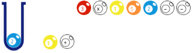

## 动画设计
 想象一下，我们有这么一串输入字符“21+3*152--”，每一个字符就是一个台球。那么就有这样一串按顺序排列测台球：
。而“栈”就想象成一个上面开口的长桶，  


桶的口径刚好可以放进一个球，  
 

我们把球一个个放进桶中，或从桶里拿出的过程球就好像进栈和出栈的过程，用动画来展示出来。 

 

如果碰到运算符，就以相反顺序取出小球参与运算，得到代表结果的新的台球，
 

 

 

再放回桶中。

 


## 类的设计
```
# 桶
    class Tube:
        属性：
            一个模拟桶容器的数组
        方法：
            进栈
            出栈
            画出自己（和桶里的球）
# 球
    class Ball:
        属性：
            球代表的数
            球在屏幕上的坐标
        方法：
            画出自己
```

## 图形库
可使用Tkinter库来处理图形界面